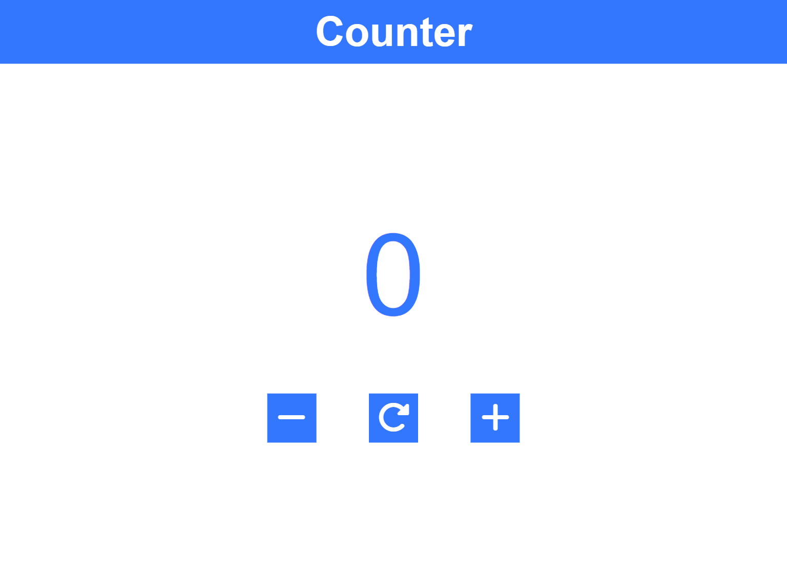

# Counter Program

This is a simple responsive counter program

## Table of contents

- [Overview](#overview)
  - [Screenshot](#screenshot)
  - [Links](#links)
- [My process](#my-process)
  - [Built with](#built-with)

## Overview

### Screenshot

### Links

- Solution URL: [https://github.com/mukul-km/counterProgram](https://github.com/mukul-km/counterProgram)
- Live Site URL: [https://mukul-km.github.io/counterProgram/](https://mukul-km.github.io/counterProgram/)

## My process

### Built with

- Semantic HTML5 markup
- CSS custom properties
- Flexbox
- Mobile-first workflow
